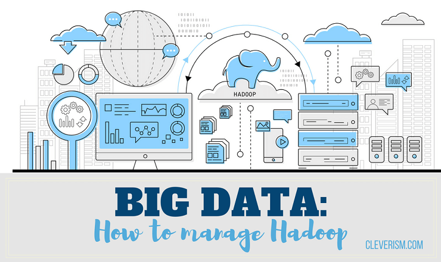
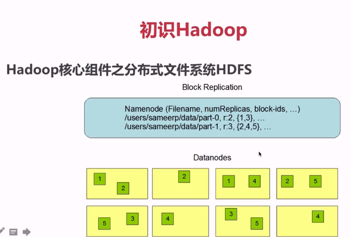
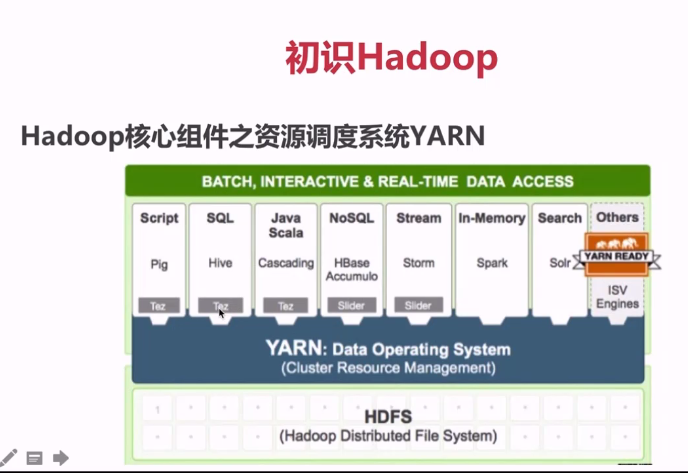
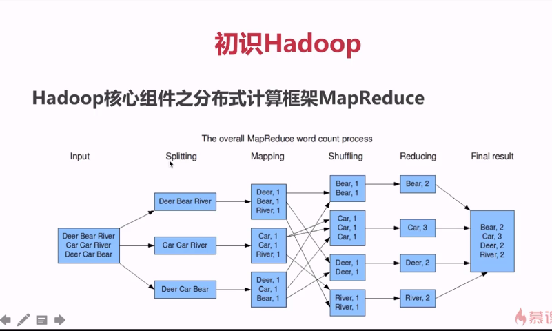
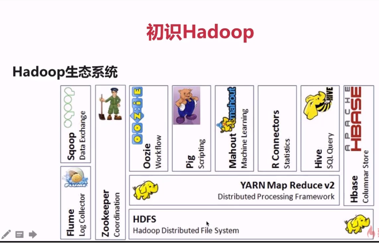

### What Hadoop can do?
  - 搭建大型数据仓库，PB级数据的存储、处理、分析、统计等业务
  - Search Engine
  - Logs Analytic
  - Business Intelligence
  - Data Mining

### Hadoop核心组件之分布式文件系统HDFS
  - 源自于Google的GFS论文，论文发表于2003年10月
  - HDF是GFS的克隆版
  - HDFS特点：扩展性&容错性&海量数据存储
  - 将文件切分成指定大小的数据块（默认是128MB) 并以多副本的存储在多个机器上
  - 数据切分、多副本、容错等操作对用户是透明度的（我们操作的时候还是以文件的方式进行操作）

  

### Hadoop核心组件之资源调度系统YARN
  - YARN：Yet Another Resource Negotiator
  - 负责整个集群资源的管理和调控
  - YARN特点：扩展性&容错性&多框架资源统一调度

  

### Hadoop核心组件之分布式计算框架MapReduce
  - 源自于Google的MapReduce论文，论文发表于2004年12月
  - MapReduce是Google MapReduce的克隆版
  - MapReduce特点：扩展性&容错性&海量数据离线处理（并不能做实时处理）

    

### Hadoop优势之高可靠性
  - 数据存储：数据块多副本
  - 数据计算：重新调度作业计算

### Hadoop优势之高扩展性
  - 存储/计算资源不够时，可以横向的线性扩展机器
  - 一个集群中可以包含数以千计的节点

### Hadoop优势之其它
  - 存储在廉价机器上，降低成本
  - 成熟的生态圈

### 狭义Hadoop VS 广义Hadoop
  - 狭义的Hadoop：是一个适合大数据分布式存储（HDFS）、分布式计算（MapReduce）和资源调度（YARN）的平台；

  - 广义的Hadoop：指的是Hadoop生态系统，Hadoop生态系统是一个很庞大的概念，hadoop是其中最重要最基础的一个部分；生态系统中的每一子系统只能解决某一个特定的问题域（甚至可能很窄），不搞统一型的一个全能系统，而是小而精的多个小系统。

  

### Hadoop生态系统的特点

  - 开源、社区活跃
  - 囊括了大数据处理的方方面面
  - 成熟的生态圈

### Hadoop常用发行版及选型

  - Apache Hadoop (Jar包冲突很严重)
  - CDH: Cloudera Distributed Hadoop (和Spark合作也是特别好的)
  - HDP: Hortonworks Data Platform

[Haddop十年发展史](https://nbcache02.baidupcs.com/file/0bc925fb8b5bf6a4b9c22e26fd79f890?bkt=p3-14000bc925fb8b5bf6a4b9c22e26fd79f890b2d50cd00000002d0807&xcode=481d9c363d55b0ef32adfc7311bf22713b84d5ceec07b00e2d5b9d77929d6c94791280ceb45a44eb518c616d610c23f60b2977702d3e6764&fid=3196772168-250528-278011861212688&time=1551188005&sign=FDTAXGERQBHSKf-DCb740ccc5511e5e8fedcff06b081203-3emAVzzsHXx4V0eetUTc9fNpcwQ%3D&to=p6&size=2951175&sta_dx=2951175&sta_cs=13&sta_ft=pdf&sta_ct=7&sta_mt=7&fm2=MH%2CYangquan%2CAnywhere%2C%2CNone%2Cany&ctime=1462522131&mtime=1462522131&resv0=cdnback&resv1=0&vuk=3123474282&iv=2&htype=&newver=1&newfm=1&secfm=1&flow_ver=3&pkey=14000bc925fb8b5bf6a4b9c22e26fd79f890b2d50cd00000002d0807&expires=8h&rt=sh&r=694483757&mlogid=1319629710449785727&vbdid=2468686823&fin=Hadoop-10-years.pdf&fn=Hadoop-10-years.pdf&rtype=1&dp-logid=1319629710449785727&dp-callid=0.1.1&hps=1&tsl=0&csl=0&csign=O6DansXhtOAnOEnNNOdq52C8LNU%3D&so=0&ut=1&uter=4&serv=0&uc=2262329576&ti=c726bd74afbfe852e42b16eb0c3c4b3717be2d0de9b73977&by=themis)

 
 
 
--------
### N.E.R.D Lights Up the Stage with 'Lemon
<iframe width="876" height="493" src="https://www.youtube.com/embed/IB1hhlT0Ytg" frameborder="0" allow="accelerometer; autoplay; encrypted-media; gyroscope; picture-in-picture" allowfullscreen></iframe>
