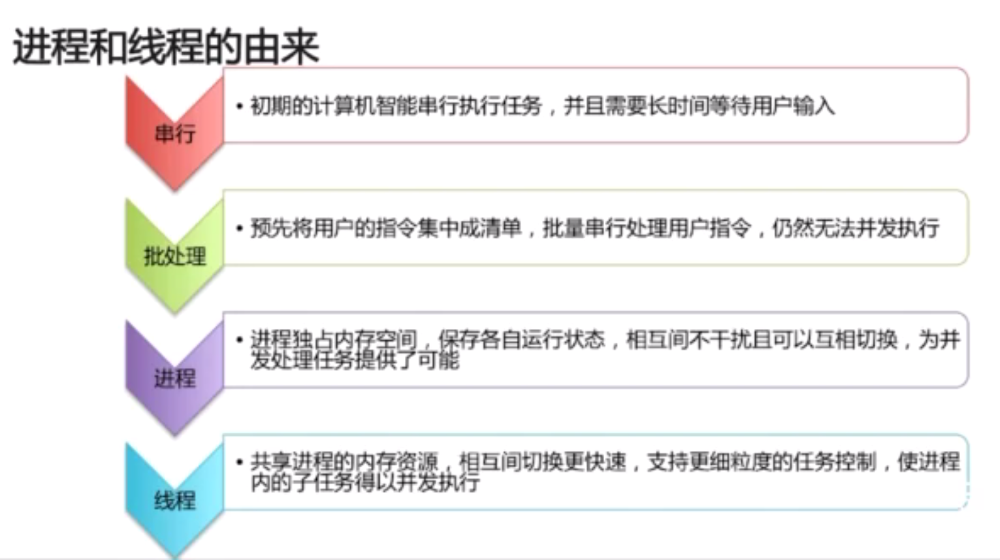

### 进程和线程的区别

- 进程是资源分配的最小单位，线程是CPU调度的最小单位

  - 所有与进程相关的资源，都被记录在PCB中
  - 进程是抢占处理机的调度单位；线程属于某个进程，共享其资源
  - 线程只由堆栈寄存器、程序计数器和TCB组成

- Summary
  - 线程不能开做独立的应用，而进程可看做独立的应用
  - 进程有独立的地址空间，互相不影响，线程只是进程的不同执行路径
  - 线程没有独立的地址空间，多进程的程序比多线程程序健壮
  - 进程的切换比线程的切换开销大

- Java进程和线程的关系

  - Java对操作系统提供的功能进行封装，包括进程和线程
  - 运行一个程序会产生一个进程， 进程包含至少一个线程
  - 每个进程对应一个JVM实例，多个线程共享JVM里的堆
  - Java采用单线程编程模型，程序会自动创建主线程
  - 主线程可以创建子线程，原则上要后于子线程完成执行

### Thread中start和run的区别

  - 调用star()方法会创建一个新的子线程并启动
  - run()方法只是Thread的一个普通方法的调用

### Thread和Runnable的关系

  - Thread是实现了Runnable接口的类，使得run支持多线程
  - 因此类的单一继承原则，推荐多使用Runnable接口

Lil Pump - Be Like Me
<iframe width="760" height="428" src="https://www.youtube.com/embed/X1VAIGkKfvg" frameborder="0" allow="accelerometer; autoplay; encrypted-media; gyroscope; picture-in-picture" allowfullscreen></iframe>
