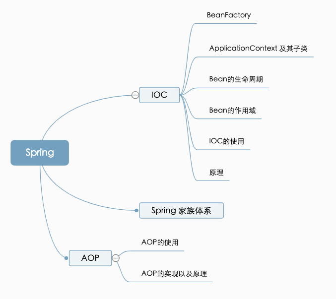

### Do you understand the Spring IOC ?

 - The core part of the Spring Core
 - Eg: How to design a luggage.
   - tire <- depend - bottome <- depend - framework <- depend - luggage

### High level Part depend Low level part

```
public class Luggage {
  private Framework framework;
  Luggage(){
    this.framework = new Framework();
  }
  public void move(){
    //... 相关逻辑
  }
}
```

```
public class Framework {
  private Bottom bottom;
  Framework(){
    this.bottom = new Bottom();
  }
}

```


```
public class Bottom {
  private Tire tire;
  Bottom() {
    this.tire = new Tire();
  }
}
```

```
public class Tire{
  private int size;
  Tire(){
    this.size = 20;
  }
}
```

### IOC (dependency injection)
- 依赖注入：把底层类作为参数传递给上层类，实现上层类对下层类的“控制”

- Eg: How to design a luggage.
  - luggage <- Injection - framework <- Injection - bottome <- Injection -


### The logic of the "getBean()" code

  - 转换beanName
  - 从缓存中加载实例
  - 实例化Bean
  - 检测parentBeanFactory
  - 初始化依赖的Bean
  - 创建Bean

### Spring Bean 的作用域

  - singleton: Spring的默认作用域，容器里拥有唯一的Bean实例
  - prototype: 针对每个getBean请求，容器都会创建一个Bean实例
  - request: 会为每个Http请求创建一个Bean实例
  - session: 会为每个session创建一个Bean实例
  - globalSession: 会为每个全局Http Session创建一个Bean实例，该作用域仅对Portlet有效

### Spring Bean的生命周期

- 创建过程
  1. 实例化bean
  2. Aware(注入Bean ID, BeanFactory 和 AppCtx)
  3. BeanPostProcessor(s).postProcessBeforeInitialization
  4. InitializingBean(s).afterPropertiesSet
  5. 定制的Bean init方法
  6. BeanPOstProcessor(s).postProcessAfterInitialization
  7. Bean初始化完毕

- 销毁过程
  1. 若实现了DisposableBean接口，则会调用destroy方法
  2. 若配置了destry-method属性， 则会调用其配置的销毁方法

### Do you really understand the Spring autoplay

- 关注点分离：不同的问题交给不同的部分去解决

  - 面向切面编程AOP正是此种技术的体现
  - 通用化功能代码的实现，对应的就是所谓的切面（Aspect）
  - 业务功能代码和切面代码分开后，架构将变得高内聚低耦合
  - 确保功能的完整性：切面最终需要被合并到业务中（Weave）

- AOP的主要名词概念

  - Aspect：通用功能的代码实现
  - Target：被植入Aspect的对象
  - Join Point：可以作为切入点的机会，所有方法都可以作为切入点
  - Pointcut：Aspect实际被应用在Join Point，支持正则
  - Advice：类里的方法以及这个方法如何植入到目标方法的方式
  - Weaving: Aop的实现过程

- Advice的种类
  - 前置通知(Before)
  - 后置通知(AfterReturning)
  - 异常通知(AfterThrowing)
  - 最终通知(After)
  - 环绕通知(Around)


